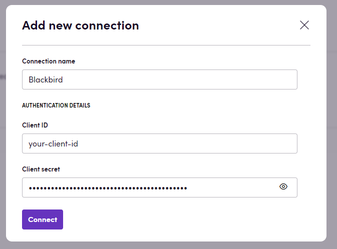
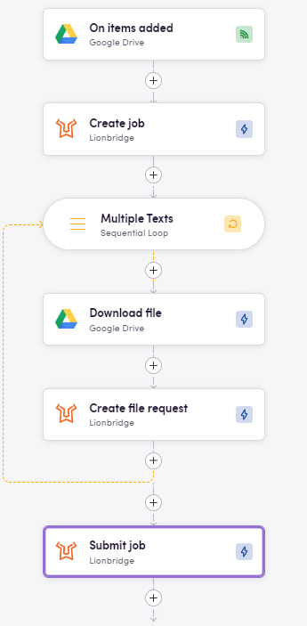
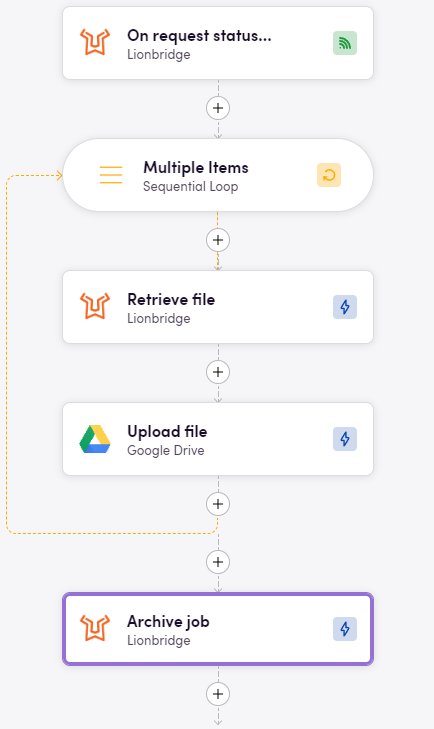

# Blackbird.io Lionbridge

Blackbird is the new automation backbone for the language technology industry. Blackbird provides enterprise-scale automation and orchestration with a simple no-code/low-code platform. Blackbird enables ambitious organizations to identify, vet, and automate as many processes as possible. Not just localization workflows, but any business and IT process. This repository represents an application that is deployable on Blackbird and usable inside the workflow editor.

## Introduction

<!-- begin docs -->

Lionbridge is the translation and localization expert. Advanced automation tools are indispensable to simplify your content journey and effectively reach your customers faster and more cost-efficiently than ever before.

## Before setting up

Before you can connect you need to make sure that:

- You must have **Client ID** and **Client Secret**
- Have at least one provider to build Lionbridge workflow

## Connecting 

1. Navigate to apps and search for Contentstack. If you cannot find Contentstack, then click _Add App_ in the top right corner, select Contentstack, and add the app to your Blackbird environment.
2. Click _Add Connection_.
3. Name your connection for future reference, e.g., 'My client'.
4. In the _API Key_ field, input your API Key
5. In the _Client secret_ field, input your Client secret
6. Click _Connect_.
7. Confirm that the connection has appeared and the status is _Connected_.

## Actions

### Jobs

- **Create job**: Create a new job by providing details such as the job's name, description, provider ID, and any specific metadata. This action initiates a new job within the system, setting it up for further operations like submission or updating.

- **Delete job**: Remove an existing job from the system using its unique job ID. This action is irreversible and should be used when a job is no longer needed or was created in error.

- **Get job**: Retrieve the details of a specific job by its ID. This includes all the information associated with the job, such as its current status, provider details, and any related files or requests.

- **Update job**: Modify the details of an existing job. This can include changing the job's name, description, provider, or status. Special instructions for completing the job or transitioning it to an 'In translation' status can also be handled here.

- **Submit job**: Forward a job to a selected provider for translation. This action takes an existing job and officially starts the translation process with the specified provider.

- **Archive job**: Move a job to archival storage, which is used for jobs that are completed or inactive but need to be retained for record-keeping.

- **Unarchive job**: Reverse the archival of a job, bringing it back into active status. This is used when an archived job needs to be revisited or reactivated.

### Requests

- **Get requests**: View a list of your translation requests. This method allows users to retrieve a summary of all translation requests associated with a job.

- **Create file request**: Start a new request to translate a document by uploading a document file. If the 'Request name' or 'Source native ID' are not specified, the system generates unique identifiers (GUIDs) for them.

- **Get request**: View details of a specific translation request. This action fetches detailed information about a single translation request, including its current status, source and target languages, and any associated metadata.

- **Delete request**: Remove a translation request no longer needed. When a translation request is no longer required, this method can be used to delete it from the system, keeping the list of active requests clean and manageable.

- **Approve request**: Approve a request to send it to the provider. Before a translation request is sent out for translation, it can be reviewed and approved through this method, signaling readiness for translation to commence.

- **Reject request**: Reject a translation request. If a translation request is found to be unnecessary or incorrect, it can be rejected, preventing it from being sent to the translation provider.

- **Update request content**: Make changes to the details of an existing translation request. This method allows users to modify the content or parameters of a translation request, such as updating the document or changing the target language.

### Source file

- **Retrieve file**: Download a document from a specific request. This method allows for the retrieval of a file associated with a translation request. It checks if the uploaded file is empty and throws an exception if so. If the file has no specific name, it defaults to using the request name with an .xml extension, indicating that the request was likely created from source content. This approach ensures that every document, whether initially named or not, is retrievable and properly identified within the system.

### Support assets

- **Get support asset**: Retrieve details about a specific support asset linked to a job. This action is essential for accessing the properties and information of support assets, which are additional resources or documents associated with a translation job to aid in the translation process.

- **Delete support asset**: Remove a support asset from a job. This functionality is crucial for maintaining the relevancy and accuracy of the support assets associated with a job, allowing users to delete assets that are no longer needed or were added in error.

- **Add support asset**: Attach a new support asset to a job. This process involves uploading a file to be used as a support asset, providing additional context or information necessary for the translation. If the file management system ID (FMS file ID) is missing, an exception is thrown, ensuring that each support asset is properly tracked and managed within the system. The method also handles the creation of metadata for the support asset, further enriching the asset's data for use during translation.

### Translation content

- **Get translation content**: Access the original content submitted for translation in a job. This action allows users to retrieve the source material provided for translation, enabling review or verification of the content before or after the translation process.

- **Update translation content**: Update the original content submitted for translation. This method facilitates the modification of source content in a translation job, allowing for corrections, updates, or refinements to ensure accuracy and relevance of the translation output.

- **Retrieve source content**: Download the translated content for one or more translation requests

### Translation memory

- **Add translation memory**: Incorporate a translation memory file into a job.

- **Get translation memory**: Retrieve details of a specific translation memory associated with a job.

## Events

- **Job status updated**: This webhook notifies you when a job's status changes, such as when it is completed or cancelled. If specific status codes are not defined, it defaults to triggering only for jobs that are "IN_TRANSLATION". The webhook assesses various conditions like job ID matches, archival status, deletion status, and compares the current status against expected status codes. If conditions are met, detailed information about the job is returned, including its current state.

- **On request status updated**: Similar to job status updates, this webhook alerts you when a translation request reaches a certain milestone, like finishing or being cancelled. By default, it is set to activate for requests that are in the "REVIEW_TRANSLATION" status unless otherwise specified. The webhook evaluates the request's compliance with the predefined conditions, such as status codes, job ID relevance, and whether the request IDs match the expected values. Successful validation results in a detailed report on the job and the affected requests, ensuring you're always up-to-date on your translation projects' progress.

## Example

The first bird initiates a job and creates requests based on files that have been uploaded to Google Drive, and then sends it to the Lionbridge provider using the 'Submit Job' action.

The second bird activates when the provider has processed our file (or files), after which we upload it back to cloud storage (Google Drive in this example). Finally, we simply archive the job.

These birds demonstrate the common workflow in the Lionbridge app.

## Feedback

Do you want to use this app or do you have feedback on our implementation? Reach out to us using the [established channels](https://www.blackbird.io/) or create an issue.

<!-- end docs -->
